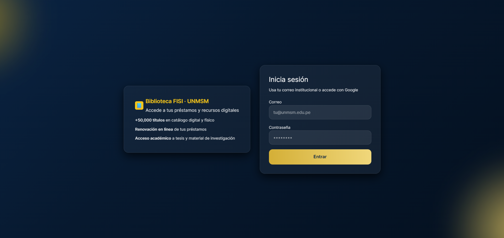
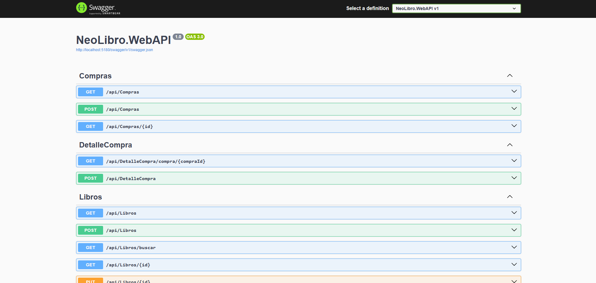

<div align="center">

# 📚 Sistema de Gestión de Biblioteca Universitaria


**Sistema completo de gestión bibliotecaria con interfaz web moderna y API REST robusta**

[Características](#-características) • [Tecnologías](#-tecnologías) • [Instalación](#-instalación) • [Documentación](#-documentación) • [Capturas](#-capturas-de-pantalla)

</div>

---

## 📋 Tabla de Contenidos

- [Sobre el Proyecto](#-sobre-el-proyecto)
- [Características](#-características)
- [Tecnologías](#-tecnologías)
- [Estructura del Proyecto](#-estructura-del-proyecto)
- [Instalación](#-instalación)
- [Uso](#-uso)
- [Capturas de Pantalla](#-capturas-de-pantalla)
- [API Endpoints](#-api-endpoints)
- [Documentación](#-documentación)
- [Colaboradores](#-colaboradores)
- [Licencia](#-licencia)

---

## 🎯 Sobre el Proyecto

Sistema integral de gestión bibliotecaria desarrollado para facilitar la administración de libros, usuarios, préstamos y devoluciones en entornos universitarios. Incluye funcionalidades avanzadas como autenticación SSO, API pública, recomendaciones de profesores y gestión masiva de datos.

### ✨ Características Principales

#### 📖 Gestión de Libros
- ✅ Catálogo completo con información bibliográfica detallada
- ✅ Sistema de clasificación LCC (Library of Congress Classification)
- ✅ Gestión de ejemplares con códigos de barras
- ✅ Carga masiva de datos desde archivos CSV/Excel
- ✅ Búsqueda avanzada y filtros múltiples

#### 👥 Gestión de Usuarios
- ✅ Sistema de roles (Administrador, Bibliotecaria, Profesor, Estudiante)
- ✅ Autenticación SSO con Google (solo emails institucionales)
- ✅ Perfiles de usuario personalizados
- ✅ Historial de préstamos y reservas

#### 🔄 Préstamos y Devoluciones
- ✅ Registro de préstamos con escáner de código de barras
- ✅ Sistema de renovaciones automáticas
- ✅ Gestión de devoluciones con código de barras
- ✅ Control de fechas de vencimiento
- ✅ Sistema de multas automáticas

#### 📊 Reportes y Estadísticas
- ✅ Dashboard administrativo con métricas en tiempo real
- ✅ Reportes de préstamos por período
- ✅ Libros más prestados
- ✅ Usuarios más activos
- ✅ Estadísticas por rol

#### 🎓 Recomendaciones de Profesores
- ✅ Sistema de recomendaciones bibliográficas
- ✅ Catálogo público de recomendaciones
- ✅ Gestión de recomendaciones por profesores

#### 🔌 API Pública
- ✅ API REST documentada con Swagger
- ✅ Autenticación por API Key
- ✅ Rate limiting y seguridad
- ✅ Endpoints públicos para integración

---

## 🛠️ Tecnologías

### Frontend
| Tecnología | Versión | Propósito |
|------------|---------|-----------|
| **React** | 18+ | Framework UI |
| **TypeScript** | 5.0+ | Tipado estático |
| **Vite** | Latest | Build tool y dev server |
| **TailwindCSS** | Latest | Estilos y diseño |
| **React Router** | Latest | Navegación |
| **Axios** | Latest | Cliente HTTP |
| **Lucide React** | Latest | Iconos |

### Backend
| Tecnología | Versión | Propósito |
|------------|---------|-----------|
| **.NET** | 9.0 | Framework backend |
| **ASP.NET Core** | 9.0 | Web API |
| **Entity Framework Core** | 9.0 | ORM |
| **SQL Server** | 2019+ | Base de datos |
| **Swagger/OpenAPI** | Latest | Documentación API |
| **Google OAuth2** | Latest | Autenticación SSO |

### Herramientas
- **Git** - Control de versiones
- **GitHub** - Repositorio remoto
- **PowerShell** - Scripts de automatización

---

## 📂 Estructura del Proyecto

```
biblioteca-facultad/
├── 📁 frontend/
│   └── frontend/              # Aplicación React + Vite
│       ├── src/
│       │   ├── api/          # Clientes API
│       │   ├── components/   # Componentes reutilizables
│       │   ├── features/      # Módulos por funcionalidad
│       │   └── App.tsx       # Componente principal
│       ├── public/           # Archivos estáticos
│       └── package.json      # Dependencias frontend
│
├── 📁 backend/
│   └── NeoLibro.WebAPI/      # API .NET
│       ├── Controllers/      # Controladores API
│       ├── Business/         # Lógica de negocio
│       ├── Data/            # Repositorios y acceso a datos
│       ├── Models/          # Entidades y DTOs
│       ├── Interfaces/      # Contratos
│       ├── Middleware/       # Middleware personalizado
│       └── Helpers/         # Utilidades
│
├── 📁 database/              # Scripts SQL
│   ├── BibliotecaFISI_Simplificado.sql
│   └── *.sql                # Scripts de migración
│
├── 📁 docs/                  # Documentación adicional
│   ├── README.md
│   ├── assets/              # Imágenes y recursos
│   └── *.md                 # Guías y documentación
│
└── 📄 README.md             # Este archivo
```

---

## 🚀 Instalación

### Prerrequisitos

- [.NET 9.0 SDK](https://dotnet.microsoft.com/download)
- [Node.js](https://nodejs.org/) (v18 o superior)
- [SQL Server](https://www.microsoft.com/sql-server) (2019 o superior)
- [Git](https://git-scm.com/)

### Paso 1: Clonar el Repositorio

```bash
git clone https://github.com/G-E-L-O/biblioteca-facultad.git
cd biblioteca-facultad
```

### Paso 2: Configurar la Base de Datos

1. **Crear la base de datos en SQL Server:**
   ```sql
   CREATE DATABASE BibliotecaDB;
   ```

2. **Ejecutar el script de creación:**
   ```bash
   # Ejecutar el script desde SQL Server Management Studio o línea de comandos
   # Archivo: database/BibliotecaFISI_Simplificado.sql
   ```

3. **Configurar la cadena de conexión** en `backend/NeoLibro.WebAPI/appsettings.json`:
   ```json
   {
     "ConnectionStrings": {
       "DefaultConnection": "Server=localhost;Database=BibliotecaDB;User Id=sa;Password=TuPassword123;TrustServerCertificate=true;"
     }
   }
   ```

### Paso 3: Configurar el Backend

```bash
cd backend/NeoLibro.WebAPI

# Restaurar dependencias
dotnet restore

# Compilar el proyecto
dotnet build

# Ejecutar la API
dotnet run
```

La API estará disponible en:
- **API:** `http://localhost:5000`
- **Swagger UI:** `http://localhost:5000/swagger`

### Paso 4: Configurar el Frontend

```bash
cd frontend/frontend

# Instalar dependencias
npm install

# Ejecutar en modo desarrollo
npm run dev
```

El frontend estará disponible en:
- **Aplicación:** `http://localhost:5173`

### Paso 5: Configurar SSO con Google (Opcional)

Ver la guía completa en [`CONFIGURAR_SSO_GOOGLE.md`](CONFIGURAR_SSO_GOOGLE.md)

---

## 💻 Uso

### Roles del Sistema

- **Administrador:** Acceso completo al sistema
- **Bibliotecaria:** Gestión de préstamos, devoluciones y libros
- **Profesor:** Acceso a catálogo y sistema de recomendaciones
- **Estudiante:** Consulta de catálogo y gestión de préstamos personales

### Funcionalidades Principales

#### Para Administradores
- Gestión completa de libros y ejemplares
- Carga masiva de datos desde CSV/Excel
- Gestión de usuarios y roles
- Visualización de reportes y estadísticas
- Configuración del sistema

#### Para Bibliotecarias
- Registro de préstamos con escáner de código de barras
- Procesamiento de devoluciones
- Gestión de multas
- Consulta de historial de préstamos

#### Para Profesores
- Crear recomendaciones bibliográficas
- Ver catálogo completo
- Gestionar recomendaciones propias

#### Para Estudiantes
- Buscar libros en el catálogo
- Ver préstamos activos
- Renovar préstamos
- Ver historial personal

---

## 📸 Capturas de Pantalla

<div align="center">

### 🖥️ Frontend - Pantalla de Login


### 📚 Frontend - Catálogo de Libros


### 🔌 Backend - API Swagger


</div>

---

## 🔌 API Endpoints

### Autenticación
| Método | Endpoint | Descripción |
|--------|----------|-------------|
| `POST` | `/api/Auth/login` | Inicio de sesión tradicional |
| `POST` | `/api/Auth/sso/google` | Autenticación SSO con Google |
| `POST` | `/api/Auth/logout` | Cerrar sesión |

### Libros
| Método | Endpoint | Descripción |
|--------|----------|-------------|
| `GET` | `/api/Libros` | Listar todos los libros |
| `GET` | `/api/Libros/{id}` | Obtener libro por ID |
| `POST` | `/api/Libros` | Crear nuevo libro |
| `PUT` | `/api/Libros/{id}` | Actualizar libro |
| `DELETE` | `/api/Libros/{id}` | Eliminar libro |
| `POST` | `/api/Libros/carga-masiva` | Carga masiva desde archivo |

### Préstamos
| Método | Endpoint | Descripción |
|--------|----------|-------------|
| `GET` | `/api/Prestamos/activos` | Listar préstamos activos |
| `GET` | `/api/Prestamos/mis-prestamos` | Préstamos del usuario actual |
| `POST` | `/api/Prestamos` | Crear nuevo préstamo |
| `PUT` | `/api/Prestamos/{id}/devolucion` | Procesar devolución |

### Recomendaciones
| Método | Endpoint | Descripción |
|--------|----------|-------------|
| `GET` | `/api/Recomendaciones/publicas` | Recomendaciones públicas |
| `GET` | `/api/Recomendaciones/mis-recomendaciones` | Recomendaciones del profesor |
| `POST` | `/api/Recomendaciones` | Crear recomendación |

### API Pública
| Método | Endpoint | Descripción |
|--------|----------|-------------|
| `GET` | `/api/PublicApi/libros` | Listar libros (público) |
| `GET` | `/api/PublicApi/libros/{id}` | Obtener libro (público) |

> 📖 **Documentación completa:** Accede a `/swagger` cuando el backend esté ejecutándose

---

## 📚 Documentación

La documentación completa está organizada en la carpeta [`docs/`](docs/README.md):

### 🚀 Inicio Rápido
- **[Instalación Completa](docs/getting-started/installation.md)** - Guía paso a paso para configurar el proyecto
- **[Inicio Rápido](docs/getting-started/quick-start.md)** - Puesta en marcha en 5 minutos

### 📖 Guías
- **[Configuración de Base de Datos](docs/guides/database-setup.md)** - Setup de SQL Server y carga de datos
- **[Configuración de SSO](docs/guides/sso-configuration.md)** - Autenticación con Google OAuth2
- **[Configuración de API Pública](docs/guides/api-setup.md)** - API Keys y endpoints públicos

### 🏗️ Arquitectura
- **[Arquitectura del Backend](docs/architecture/backend.md)** - Estructura y patrones del API
- **[Arquitectura del Frontend](docs/architecture/frontend.md)** - Componentes y estado de React
- **[Arquitectura de Base de Datos](docs/architecture/database.md)** - Modelo de datos

### 🔌 API
- **[API Pública](docs/api/public-api.md)** - Documentación de la API pública
- **[Endpoints Completos](docs/api/endpoints.md)** - Referencia de todos los endpoints

### 🔧 Desarrollo
- **[Guía de Contribución](docs/development/contributing.md)** - Cómo contribuir al proyecto
- **[Testing](docs/development/testing.md)** - Guía de pruebas
- **[Estándares de Código](docs/development/coding-standards.md)** - Convenciones y mejores prácticas

### 🆘 Solución de Problemas
- **[Problemas Comunes](docs/troubleshooting/common-issues.md)** - Soluciones a problemas frecuentes
- **[Problemas de Base de Datos](docs/troubleshooting/database-issues.md)** - Troubleshooting de SQL Server

> 📖 **Ver [índice completo de documentación](docs/README.md)** para navegar toda la documentación

---

## 👥 Colaboradores

Este proyecto fue desarrollado por:

<table>
  <tr>
    <td align="center">
      <a href="https://github.com/G-E-L-O">
        
        <br />
        <sub><b>G-E-L-O</b></sub>
      </a>
    </td>
    <td align="center">
      <a href="https://github.com/AntonyPC-13">
        
        <br />
        <sub><b>AntonyPC-13</b></sub>
      </a>
    </td>
    <td align="center">
      <a href="https://github.com/Gianf22">
        
        <br />
        <sub><b>Gianf22</b></sub>
      </a>
    </td>
    <td align="center">
      <a href="https://github.com/ErickQuispeHuari">
        
        <br />
        <sub><b>Erick Quispe Huari</b></sub>
      </a>
    </td>
    <td align="center">
      <a href="https://github.com/JDC150">
        
        <br />
        <sub><b>JDC150</b></sub>
      </a>
    </td>
  </tr>
</table>

---

## 📄 Licencia

Este proyecto es de **uso académico y educativo**. Desarrollado como parte de un proyecto universitario.

---

<div align="center">

### ⭐ Si te gustó este proyecto, ¡dale una estrella!

**Desarrollado con ❤️ por el equipo de Biblioteca Facultad**

[](https://github.com/G-E-L-O/biblioteca-facultad)

</div>
